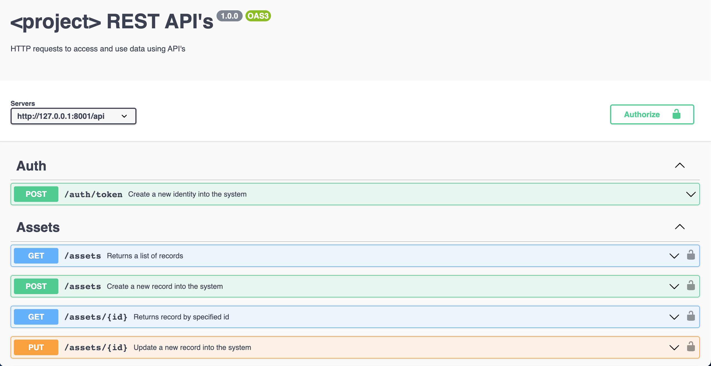

# Welcome to Nodejs Express Sandbox

This boilerplate provides the ready structure to start developing the API. It has a good structure to support the MC pattern that allows developers to separate code into multiple files.

Backend developers always need help to protect their API with tokens and they use DB or memory to store and validate the same. In this sandbox, developers will utilize simple Algorithm based authentication without traversing to the database or memory.

# Prerequisites :star2:

Things to think before you start installing and running the project
**Node:**

- NodeJS >= 16.x
- NPM >= 8.x - npm is a software Package Manager and Installer

**General:**

- Git

# Getting Started :sunrise_over_mountains:

These instructions will get you a copy of the project up and running on your local machine for development.
Here, we will learn how to set up this project for the Node.js

## Setup

_Clone or download this repo_

    $ git clone https://github.com/sunilmnagre/node-express-best-sandbox-mvc.git

_Navigate to the downloaded folder_

    $ cd node-express-best-sandbox-mvc.git

_Change to specific Git branch (optional)_

    $ git checkout <branchName>

_Install npm packages_

    $ npm install pm2 -g // Process management package
    $ npm install

## Run :rocket:

_To start app:_

    $ IV=<IV> ENCRYPTION_KEY=<Encryption_Key> pm2 start server.js --watch

ENCRYPTION_KEY = hFHXD29uVdsMDwz23I62hHw/PZZmzDtG7nAvJAzzyxg=

IV = TE0a4eBLVmMV2E6t

--watch is the option for continue development

It is mandatory to pass **ENCRYPTION_KEY** and **IV** parameters as they are required for decrypting the configuration variables
It is optional to pass **SECURE** parameter to start the app in a secure mode.

_Open any browser and type_

**http://localhost:{portNo}**

# Swagger documentation

Simplify API development for users, teams, and enterprises with the Swagger open source and professional toolset. Find out how Swagger can help you design and document your APIs at scale.

**http://localhost:{portNo}/api-docs**

        

---

## Authentication and Authorization

Auth is implemented using Polindrome Algorithm. To get the token, you need to pass a palindrome string ex:

    a) madam
    b) radar

_Navigate to folder and run following_

    $ node shared/generate-token.js TOKEN=madam

After passing it, you will get one token and that encrypted token is nothing but one Polindrome number. Now, you can use that token to authorize the other API.

For Authorization, you need to pass that token in the header of each request.

**Enjoy** :tada: :clap: :beers:
